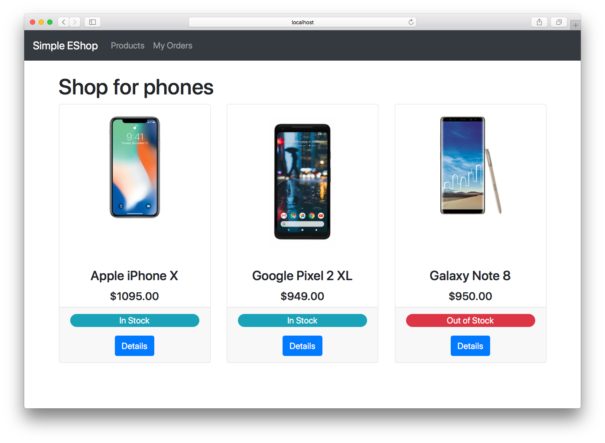

# NetCoreDemo

A demonstration of [NServiceBus](https://particular.net/nservicebus) and the [Particular Service Platform](https://particular.net/service-platform) showing several capabilities all at once:

* NServiceBus running cross-platform on .NET Core 2.0
* Ease of local development without dependencies using the [Learning Transport](https://docs.particular.net/transports/learning/?version=core_7)
* Running on an AWS-hosted Ubuntu server with the [RabbitMQ Transport](https://docs.particular.net/transports/rabbitmq/) hosted and managed by [CloudAMQP](https://www.cloudamqp.com/)
* Load simulation
* [Real-time monitoring](https://particular.net/real-time-monitoring) of queue length, throughput, scheduled retry rate, processing time, and critical time for each NServiceBus endpoint 

## Prerequisites

* To view the monitoring component of the sample, [ServiceControl](https://docs.particular.net/servicecontrol/) and [ServicePulse](https://docs.particular.net/servicepulse/) must be installed. However, they are not required to demonstrate other messaging aspects of the code.

## Running the solution locally

By default, the solution uses the [learning transport](https://docs.particular.net/transports/learning/), which is useful for demonstration and experimentation purposes. It is not meant to be used in production scenarios.

1. Open the solution in Visual Studio
1. Set the following projects as Startup projects
   * EShop.UI
   * Billing.Api
   * Marketing.Api
   * Sales.Api
   * Shipping.Api
1. Start the application

Four console windows will open, one for each endpoint. (If running on Mac, the console windows will be docked within  Visual Studio itself.) The EShop.UI web application will also appear in the default browser:



Purchase one of the products and not the log messages that appear in the various endpoint consoles.

## Monitoring the endpoints

###  Set up RabbitMQ

In order to use the monitoring capabilities, the application must be configured to use [RabbitMQ](https://docs.particular.net/transports/rabbitmq/) as the transport rather than the learning transport. RabbitMQ can  be installed locally or as a [Docker container](https://hub.docker.com/_/rabbitmq/). You can also sign up for a free account at [CloudAMQP](https://www.cloudamqp.com/) which should suffice for demonstration purposes.

The following commands will start a RabbitMQ container and enable the management console so you can connect to it at http://localhost:15672 (username: guest, password: guest):

```
docker run -d -p 5672:5672 -p 15672:15672 --name rabbit -e RABBITMQ_DEFAULT_USER=guest -e RABBITMQ_DEFAULT_PASS=guest rabbitmq
docker exec rabbit rabbitmq-plugins enable rabbitmq_management
```

### Set the connection environment variable

Once RabbitMQ is available, set an environment variable, `NetCoreDemoRabbitMQTransport`, to the connection string of your RabbitMQ instance. For local/Docker installations, this is simply: `host=localhost`. For CloudAMQP, the connection string will have the format:

> host={HOSTNAME};UserName={USERNAME};Password={PASSWORD};virtualhost={VIRTUALHOST}

The values for each parameter will be provided by CloudAMQP.

Once the environment variable is set, the application will automatically use RabbitMQ as the transport. To verify, check for the following log message for any of the endpoints:

> 2018-04-06 16:10:11.041 INFO  ITOps.Shared.CommonNServiceBusConfiguration Using RabbitMQ Transport

If the Learning Transport still appears, you may need to re-install Visual Studio to ensure the environment variable is used.

### Set up ServiceControl 

Install ServiceControl using the [Platform Installer](https://docs.particular.net/platform/installer/) and the default options. 

#### Add a ServiceControl instance

Start the ServiceControl Management utility, then click _+ NEW | Add ServiceControl Instance..._. The defaults can be used for all sections except TRANSPORT CONFIGURATION and QUEUES CONFIGURATION. Configure the transport as follows:

| TRANSPORT | RabbitMQ |
| TRANSPORT CONNECTION STRING | host=localhost |

Be sure to use the connection string that matches your environment.

In the QUEUES CONFIGURATION section, set both _error forwarding_ and _audit forwarding_ to On.

#### Add a monitoring instance

In the ServiceControl Management utility, click _+ NEW  | Add monitoring instance..._. Configure the transport in the same way as the ServiceControl instance and leave the rest with default values.

### Set up ServicePulse

Install ServicePulse using the [Platform Installer](https://docs.particular.net/platform/installer/) and the default options. It will automatically connect to the ServiceControl instance installed previously.

### Simulate load and monitor the results

1. In Visual Studio, run the solution. The endpoint console windows will appear as well as the web interface.
2. With the endpoints running, launch the LoadGenerator project from Visual Studio. This will launch a console application that continuously sends a PlaceOrder message once per second.
3. In a browser, navigate to ServicePulse at http://localhost:9090
4. Select _Monitoring_ in the menu bar to see statistics for the four endpoints

At this point, you can increase or decrease the load in the LoadGenerator console application with the up and down arrow keys. You can also press <kbd>S</kbd> to send a spike of 25 messages or press <kbd>P</kbd> to pause/unpause the load generator. It's useful to have this running side-by-side with ServicePulse to see the effects this has on the graphs.

## Deploying the application to Linux

The script `deploy.sh` will build and deploy the application to a Linux machine using the `scp` command. Update the `DEPLOY_SERVER` variable at the top of the script to match your environment. Other changes may be required to this script to ensure the `scp` command has the proper permissions for your environment.
